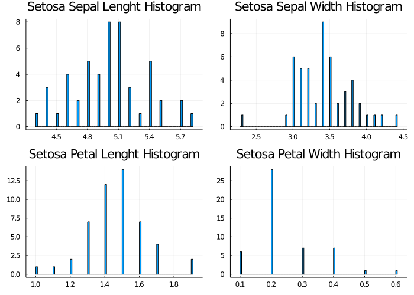
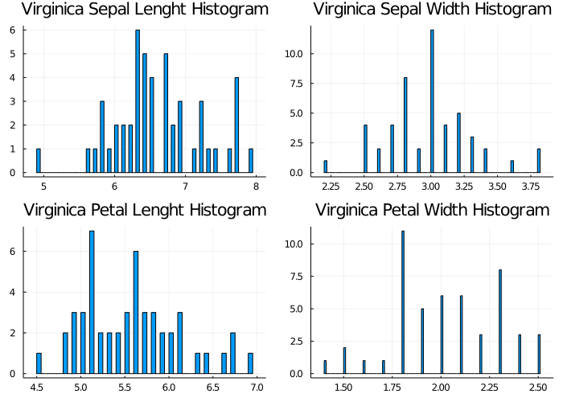
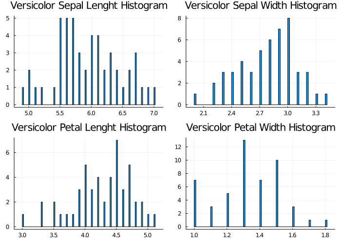

# Iris Data Analysis

[Iris](https://en.wikipedia.org/wiki/Iris_(plant)) is a genus of 260-300 species of flowering plants with showy flowers. It takes its names from the Greek word for a rainbow, which is also the name of Greek goddess of the rainbow, Iris. Some authors states that the name refers to the wide variety of flower colors found among the many species. In this docs we will analyses the **Versicolor**, **Setosa** and **Virginica** species. Also, this analysis are a way to learn Julia language development and data science.

* **The histogram** of sepals, petals length and width show us the characteristics and data distribution of this species.

  

* **Setosa specie** sepal and petal characteristics. Setosa has the larger sepals among the others being analyzed in this document. 

* **Virginica specie** sepal and petal characteristics. I has longest sepals among the other species in this document. 

* **Versicolor specie** sepal, petal width and length are between Virginica and Setosa's size.

